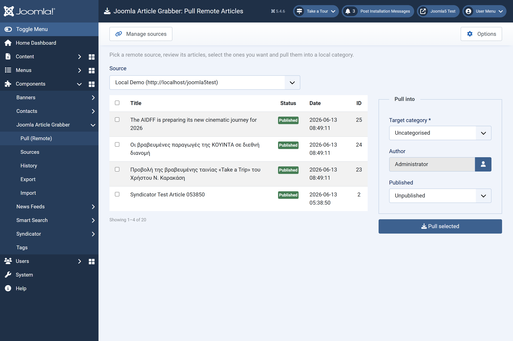
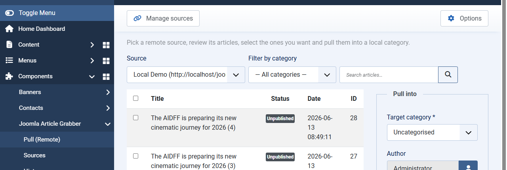
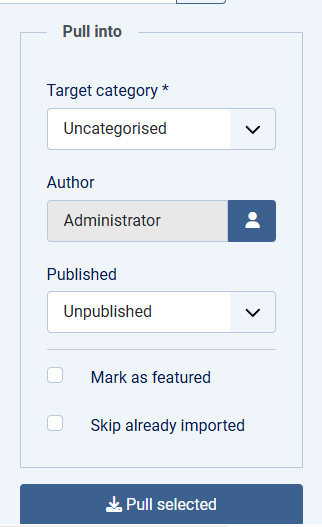
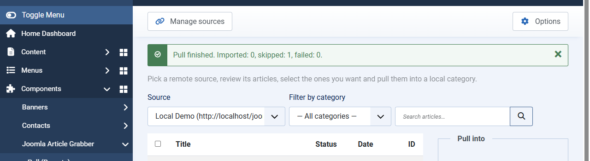
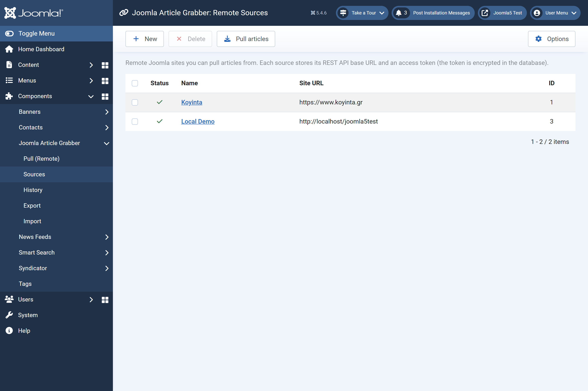
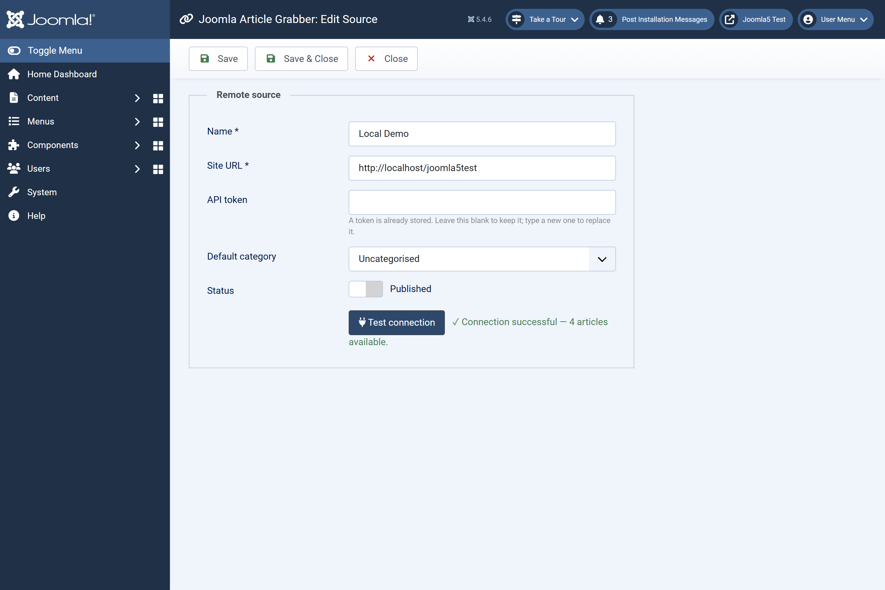
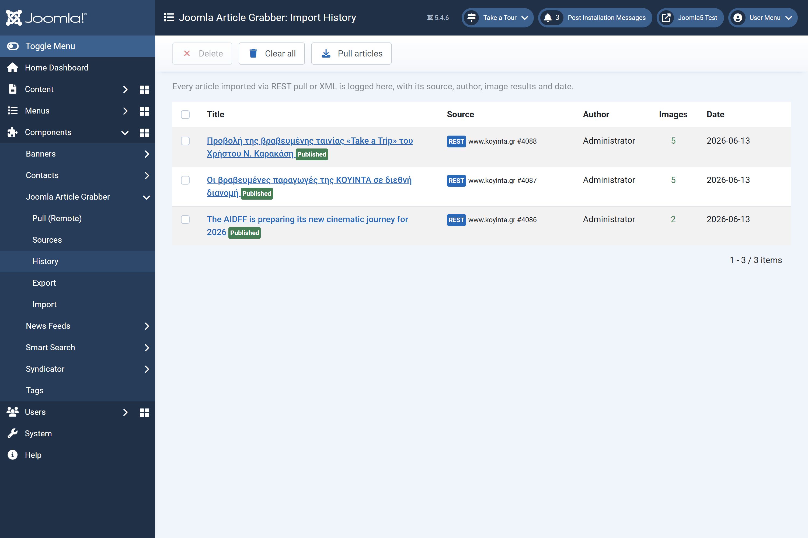
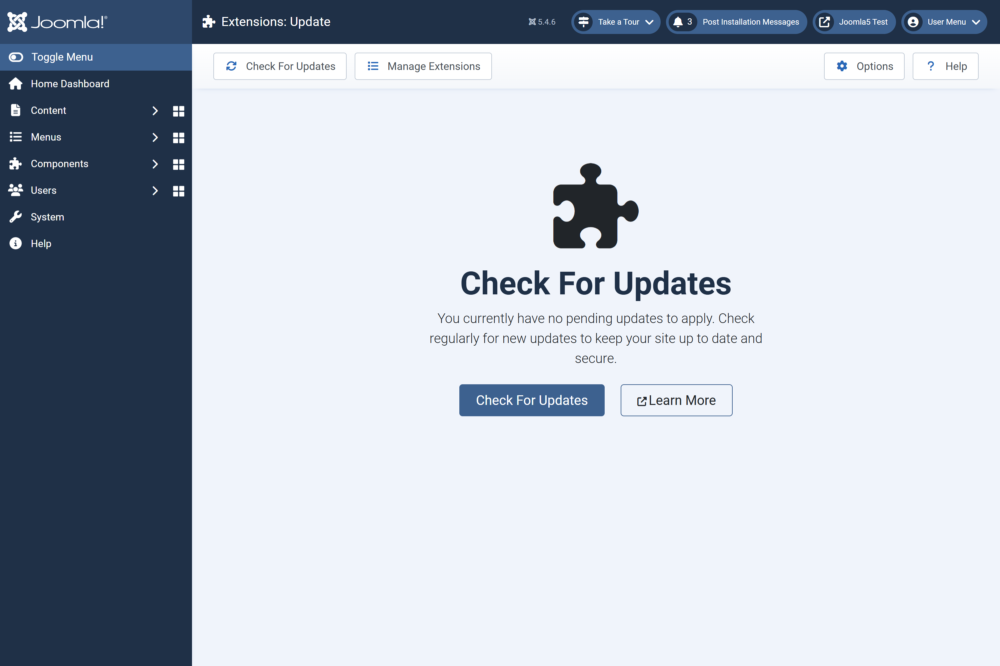

<p align="center">
  
</p>

<h1 align="center">Joomla Article Grabber</h1>

A Joomla 5 / 6 administrator component to transfer `com_content` articles (with their
images) between your Joomla sites.

## Two modes

- **REST pull** — add remote sites (URL + Joomla API token, stored **encrypted**), browse
  their articles over the Web Services API and pull selected ones into a chosen category/author.
- **XML export/import** — download an article as XML on one site and upload it on another.

Images (intro/full + inline) are downloaded locally and their paths rewritten automatically.

## Features

- **Search & category filter** — filter the remote article list by title/alias or by remote category before pulling.
- **Tag transfer** — tags are read from the remote article and created locally when they don't exist yet.
- **Date preservation** — `created`, `publish_up` and `publish_down` are carried over from the source article.
- **Featured flag** — optionally mark imported articles as front-page featured in one click.
- **Duplicate detection** — "Skip already imported" skips any article already present in the import log (matched by source + remote ID).
- **Import history** — every pull/import is logged with its source, author, image results and a link to the created article.
- **GitHub auto-update** — sites with the component installed see new releases under Extensions → Update.

## Screenshots

**Pull articles from a remote site** — pick a source, browse its articles (paginated, with search and category filter) and pull the selected ones into a local category/author:



**Search and category filter** — narrow the remote article list before selecting what to pull:



**Pull options** — set the target category, author, published state, and optionally mark as featured or skip already-imported articles:



**Duplicate detection** — articles already in the import history are skipped; the summary shows Imported / Skipped / Failed:



**Manage remote sources** (API tokens stored encrypted) with a one-click connection test:





**Import history** — every pull/import is logged with its source, author and image results:



**Built-in updates** via Extensions → Update:



## Requirements

- Joomla 5.x or 6.x
- PHP 8.1+
- For REST pull, the **remote** site must have the *Web Services - Articles* and
  *API Authentication - Joomla Token* plugins enabled, and a user API token.

## "Read more" over the REST API

Joomla's content API only exposes a single combined `text` field and drops the
read-more separator, so a plain REST pull would dump the whole body into the
intro text and lose the intro/full split. The bundled **`plg_content_apigrabber`**
plugin fixes this: installed and enabled **on the source site**, it re-inserts the
`<hr id="system-readmore" />` marker into API responses only (the site frontend is
untouched), and the grabber splits it back when pulling.

## Install

**Recommended — install the package** (component + companion plugin in one go):
Extensions → Install → Upload `pkg_articlegrabber-x.y.z.zip`.

- On a **target** site (where you pull articles into): use the component; the
  plugin can stay disabled.
- On a **source** site (whose articles are pulled over REST): enable
  *Content - Article Grabber (API Read More)* under Plugins to preserve the
  read-more split.

Standalone zips are also published if you only need one piece:
`com_content_api_grabber-x.y.z.zip` (component) and
`plg_content_apigrabber-x.y.z.zip` (plugin).

## Updates (maintainers)

Releases are automated via GitHub Actions:

```bash
# bump nothing by hand — just tag and push
git tag v1.2.0
git push origin v1.2.0
```

The workflow runs `build.sh`, publishes a GitHub Release with the package and the two
standalone zips, syncs the `<version>` in every manifest and regenerates `update.xml`. Sites that have the component installed then see the update
under **Extensions → Update**.

> Set the `<updateservers>` URL in `content_api_grabber.xml` to the raw URL of `update.xml`
> on your repository's `main` branch.

## License

GNU GPL v2 or later.
